# SAP Project Screenshots

This folder contains screenshots captured during the development and testing of the SAP S/4HANA ABAP projects.

The screenshots demonstrate the development workflow from SAP Data Dictionary and ABAP programming to ALV reporting and Excel export.

## Screenshot Overview

### 1. SE11 – Table Fields View

The screenshot shows the SAP Data Dictionary (SE11) environment used for viewing and managing table field definitions.

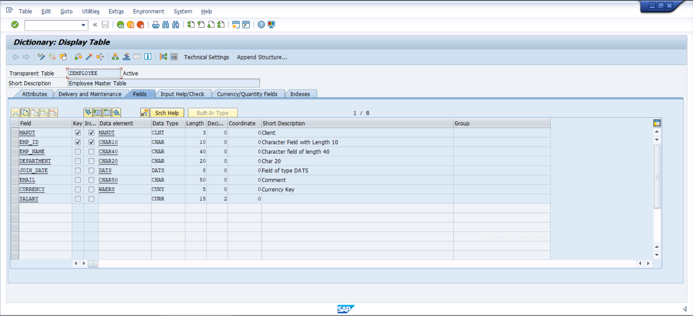

---

### 2. Database Level – Table Content

This screenshot shows the data stored at the database/table level and demonstrates how the table contents are viewed within SAP.

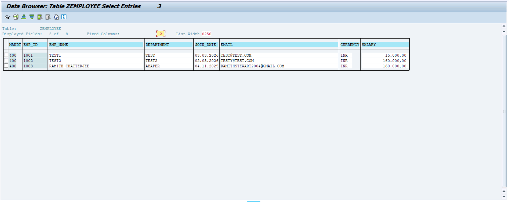

---

### 3. SE38 – ABAP Initial Screen

The SE38 screen represents the ABAP development environment used to create, maintain and execute ABAP programs.

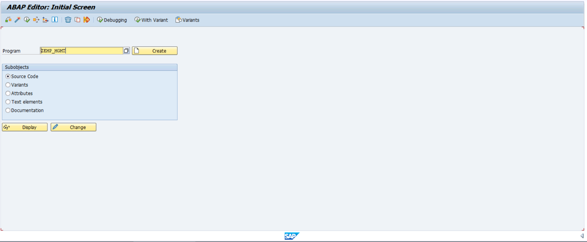

---

## ABAP Program Development

The following screenshots show different sections of the ABAP program developed in the SAP environment.

### ABAP Code – Part 1

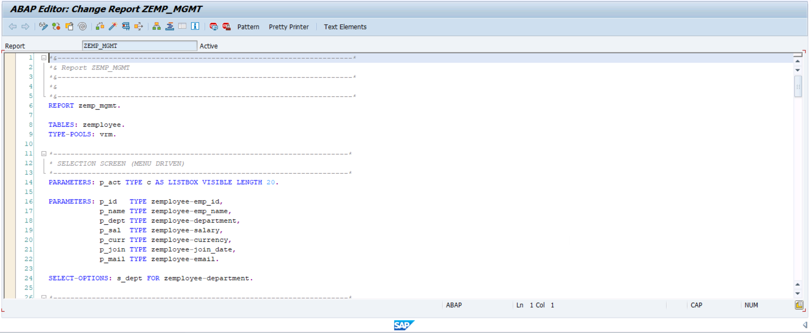

### ABAP Code – Part 2

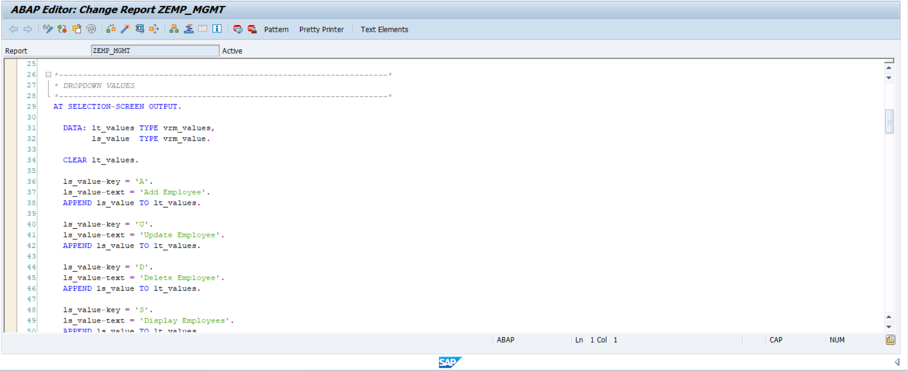

### ABAP Code – Part 3

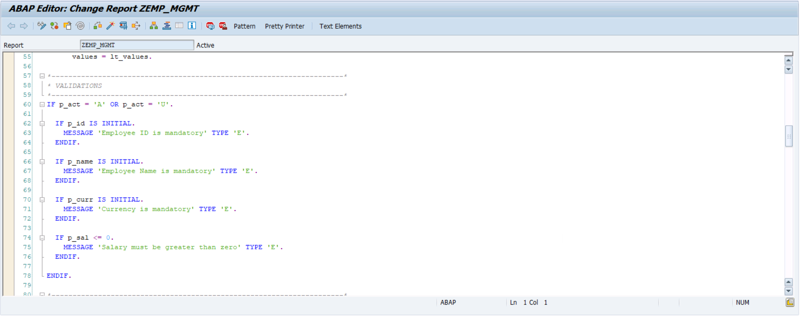

### ABAP Code – Part 4

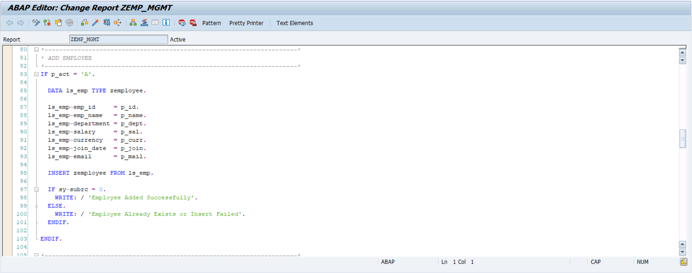

### ABAP Code – Part 5

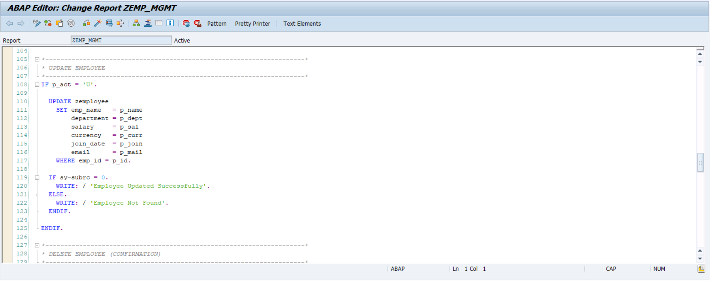

### ABAP Code – Part 6

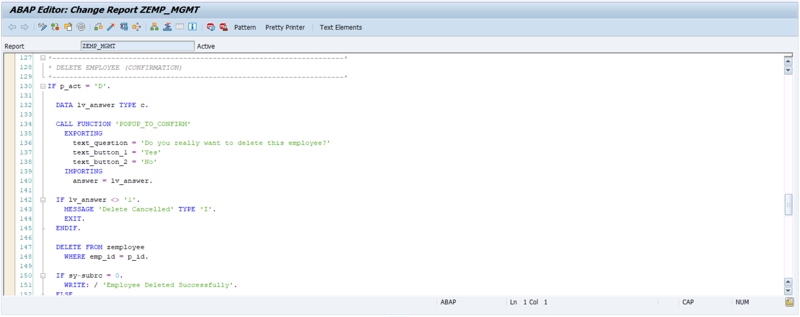

### ABAP Code – Part 7

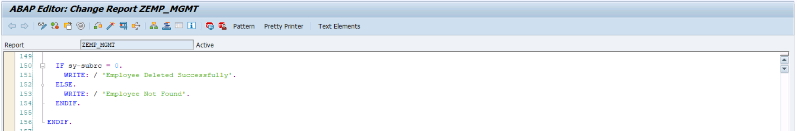

### ABAP Code – Part 8

### ABAP Code – Part 9

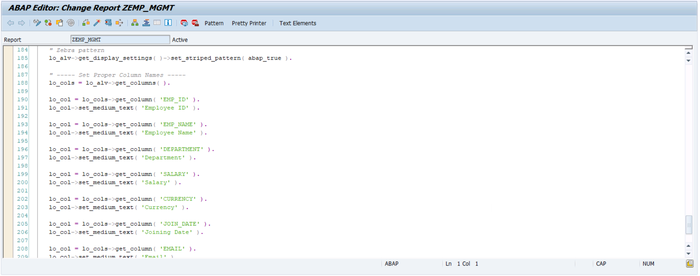

### ABAP Code – Part 10

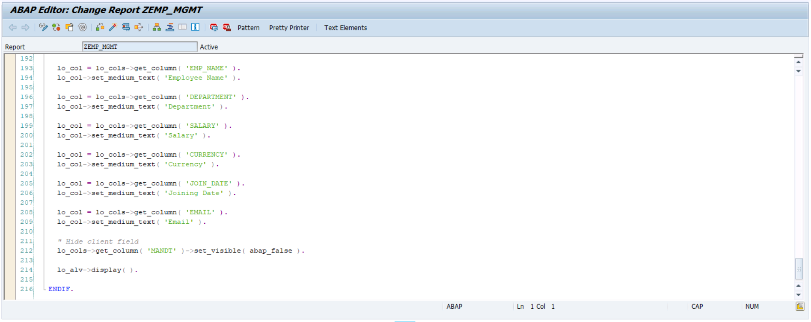

### ABAP Code – Part 11

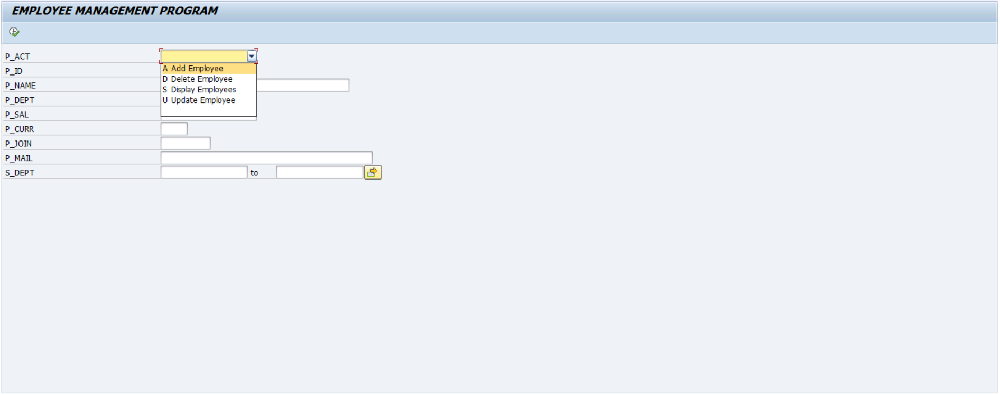

---

## ALV Reporting

### ALV Selection Screen – 1

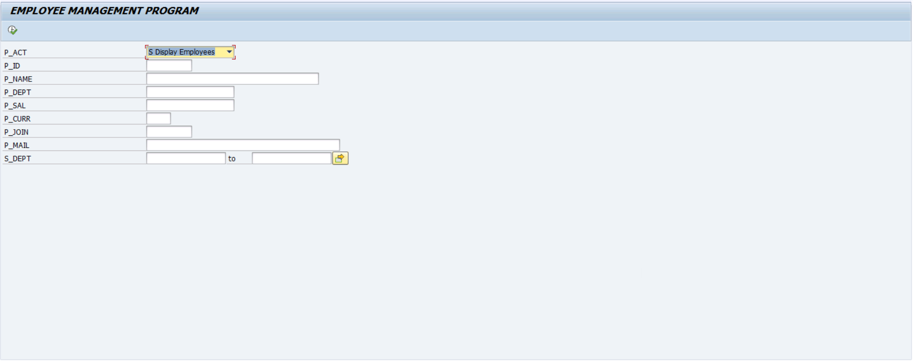

### ALV Selection Screen – 2

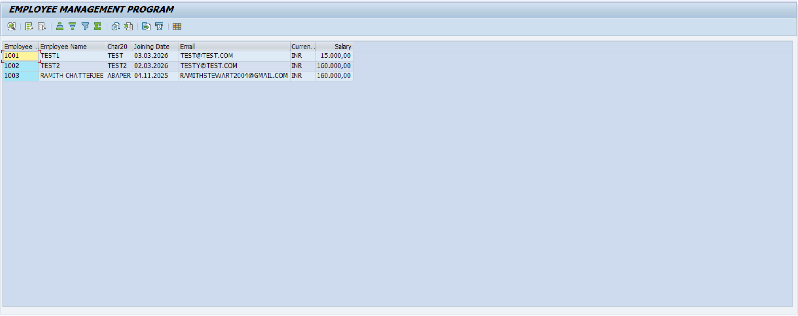

### ALV Report Output

The ALV report demonstrates structured tabular reporting with SAP data.

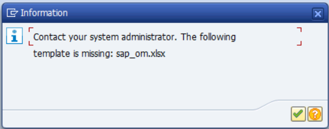

---

## Excel Export

### Excel Export Screen

This screenshot shows the Excel export process from the SAP ALV report.

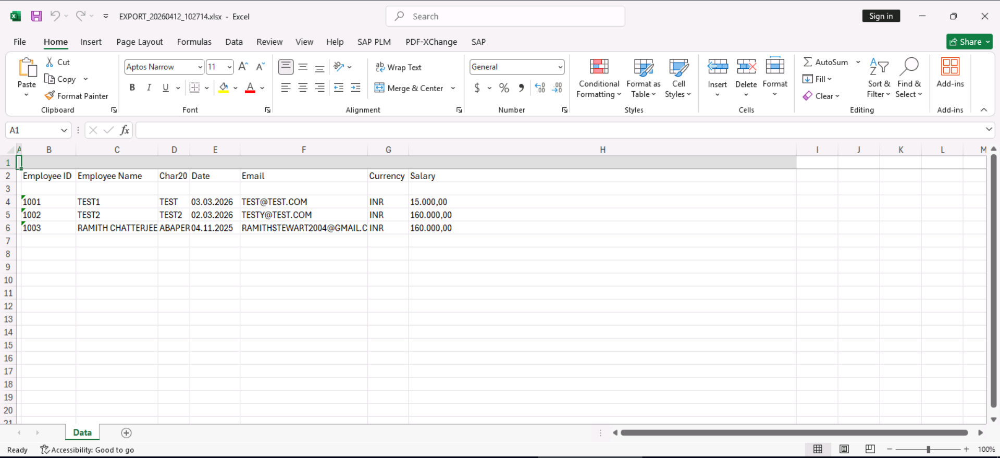

> Note: The screenshot also shows an SAP system message related to the Excel export template. It is retained as part of the original project evidence.

---

## Project Workflow

The screenshots collectively demonstrate the following SAP development workflow:

SAP Data Dictionary (SE11)
            ↓
      Table Structure
            ↓
      Database Content
            ↓
      ABAP Development (SE38)
            ↓
      ABAP Data Processing
            ↓
      ALV Selection Screen
            ↓
        ALV Report
            ↓
       Excel Export
